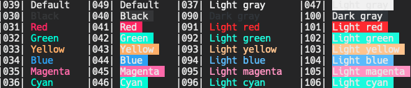

# Alacritty Panda Theme
Panda theme for alacritty

  

## Installation

Clone the repository
```
mkdir -p ~/.config/alacritty/themes
git clone https://github.com/emp-temp/alacritty-panda-theme.git ~/.config/alacritty/themes/
```

Add an import to your alacritty.toml
```
import = [
    "~/.config/alacritty/themes/alacritty-panda-theme/panda.toml"
]
```

## License
The project is available as open source under the terms of the [Apache License, Version 2.0](https://github.com/alacritty/alacritty-theme/blob/master/LICENSE)